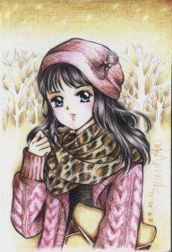
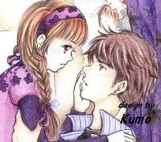
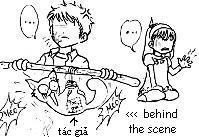
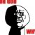

# Những chàng trai BK trong lòng tôi

Tác giả: Tường Vân

Nguồn: [Diễn đàn bka.vn](http://bka.vn/forum/threads/nhung-chang-trai-bk-trong-long-toi-d.56109/)

Nickname: Kumo

Avatar: 

Status: _Say "I'm yours", not "You're mine"! :)_

Birthday: 21 May 1987

Favorite quote: Thử thách ko phải là sống sót sau cơn đau, mà là bạn đã học được từ đó những j! -_-

Signature:

 

## Mục lục

1. [Chàng trai đầu tiên](#ch%C3%A0ng-trai-%C4%91%E1%BA%A7u-ti%C3%AAn)
1. [Chàng trai thứ 2](#ch%C3%A0ng-trai-th%E1%BB%A9-2)
1. [Một chút tâm sự](#m%E1%BB%99t-ch%C3%BAt-t%C3%A2m-s%E1%BB%B1)
1. [Chàng trai thứ 3](#ch%C3%A0ng-trai-th%E1%BB%A9-3)
1. [Chàng trai thứ 3 (tiếp)](#ch%C3%A0ng-trai-th%E1%BB%A9-3-ti%E1%BA%BFp)
1. [Chàng trai thứ 3 (tiếp)](#ch%C3%A0ng-trai-th%E1%BB%A9-3-ti%E1%BA%BFp-1)
1. [Trả lời bình luận](#tr%E1%BA%A3-l%E1%BB%9Di-b%C3%ACnh-lu%E1%BA%ADn)
1. [Chàng trai thứ 4](#ch%C3%A0ng-trai-th%E1%BB%A9-4)
1. [Chàng trai thứ 5](#ch%C3%A0ng-trai-th%E1%BB%A9-5)
1. [Chàng trai thứ 5 (tiếp)](#ch%C3%A0ng-trai-th%E1%BB%A9-5-ti%E1%BA%BFp)
1. [Chàng trai thứ 6](#ch%C3%A0ng-trai-th%E1%BB%A9-6)
1. [Bonus: Khi đối tượng ko phải zai BK](#bonus-khi-%C4%91%E1%BB%91i-t%C6%B0%E1%BB%A3ng-ko-ph%E1%BA%A3i-zai-bk)
1. [Anh non-BK thứ 2](#anh-non-bk-th%E1%BB%A9-2)
1. [Chuẩn bị chàng trai thứ 7](#chu%E1%BA%A9n-b%E1%BB%8B-ch%C3%A0ng-trai-th%E1%BB%A9-7)
1. [Chàng trai thứ 7](#ch%C3%A0ng-trai-th%E1%BB%A9-7)
1. [Chàng trai thứ 7 (tiếp)](#ch%C3%A0ng-trai-th%E1%BB%A9-7-ti%E1%BA%BFp)
1. [Chàng trai thứ 7 (tiếp)](#ch%C3%A0ng-trai-th%E1%BB%A9-7-ti%E1%BA%BFp-1)
1. [Chàng trai thứ 7 (tiếp)](#ch%C3%A0ng-trai-th%E1%BB%A9-7-ti%E1%BA%BFp-2)
1. [Chàng trai thứ 7 (tiếp)](#ch%C3%A0ng-trai-th%E1%BB%A9-7-ti%E1%BA%BFp-3)
1. [Trả lời bình luận](#tr%E1%BA%A3-l%E1%BB%9Di-b%C3%ACnh-lu%E1%BA%ADn)
1. [Trả lời bình luận (tiếp)](#tr%E1%BA%A3-l%E1%BB%9Di-b%C3%ACnh-lu%E1%BA%ADn-ti%E1%BA%BFp)
1. [Tản mạn](#t%E1%BA%A3n-m%E1%BA%A1n)
1. [Tản mạn (tiếp)](#t%E1%BA%A3n-m%E1%BA%A1n-ti%E1%BA%BFp)

## Chàng trai đầu tiên

Ngày 19/01/2013

Chậc, nhân dịp blog yahoo đóng cửa, dọn dẹp lại cuốn sổ nhật ký online đó, tự dưng lại nhớ đến mấy "mối tình" được ghi chép có cẩn thận, có thoáng qua. Phì cười khi thấy, mèng ơi, chẳng hẹn mà gặp, sao toàn zai là zai BK cả thế lày?  Chả lẽ gái BK chỉ có zai BK là ngó ngàng đến thôi sao... 

Thế cũng được. Vì mình cũng thik zai BK mà  So vs mấy chàng láng giềng XD, KT, rồi GT... thì zai BK vẫn có vẻ j đó tốt bụng và chân tình hơn cả. Đấy là mình nghĩ thế 

Đầu tiên là anh WC - HTĐ K46. Ak, chân dài đến nách nhá, quần là áo lượt, giày tây đen bóng đến là điệu đàng. Hồi trẩu tre chả hiểu mình dở hơi thế nào mà lại lên mạng chat chit, tình cờ quen anh í.

Cha này đong đưa thành thần. Nhắn tin vs những lời lẽ đậm mùi tán tỉnh mà mình thì cứ nghĩ đấy là điều bình thường mới gớm. Thử hỏi gái nhà lành lần đầu được tán tỉnh như mình sao mà đỡ nổi. Thế là chả mấy chốc mà mắc bẫy. Đến khi chàng ngỏ lời gặp gỡ thì mình mới bắt đầu lo lắng. Chả hiểu "làm bạn gái" là làm cái của khỉ j nữa. Ngây thơ v~ : ))

Rồi cũng gặp nhau. Mình ko ý thức được tính chất nghiêm trọng của sự việc, đã đánh nguyên bộ quần ngố áo phông dép lê tóc đuôi ngựa ra đi với dáng điệu hùng dũng khôn tả. Ờ, theo những j ký ức còn sót lại thì chàng đẹp trai, trắng trẻo, bảnh tỏn, cao 1m75 nặng 60kg, quê BN. Cả đời đến lúc đó, ng` duy nhất mình thấy ăn mặc như thế chỉ có mỗi... bố mình. Ẹc. Giờ nghĩ lại cũng thấy mình tàn nhẫn khi rủ anh í đi dạo hồ, lại còn ngang nhiên phủi @ ngồi cái bịch xuống cỏ trong sự khiếp đảm của ảnh nữa chứ = )) May mà còn chưa xui xẻo đến mức đạp phải... mìn mà nổ banh xác đấy, ko thì đây sẽ là ngày đáng sợ nhất trong đời ảnh mất thôi : ))

Kết cuộc, cả 2 đều thống nhất là ng` kia ko giống tưởng tượng của mình. Chàng trai BK đầu tiên đã chạy qua đời mình như thế đấy : )) Mất hút con *** hàng lươn. Đến cái dép cũng chẳng còn mà nhặt, khặc khặc. 

Lâu rồi soạn lại danh bạ đt thấy số của anh í, táy máy bấm thử. Giờ vẫn thấy phục mình khi ng` bắt máy là... vợ anh í mà vẫn to gan ngồi chém gió cả mấy chục phút đồng hồ được  Giờ anh í đang vi vu bên trời tây rùi, lấy vợ ngay sau khi ra trường hơn năm, sống ngay gần nhà mình mới chết dở. Haizzz, hy vọng ko phải vì mình hù cho đến mức phải vội vã kết hôn để tránh lịch sử lặp lại đó chứ?!

Thôi thì chúc anh hạnh phúc nhé. Chàng trai BK đầu tiên xuất hiện trong đời em! 

## Chàng trai thứ 2

Ngày 20/01/2013

Gần 1 năm sau, mình vinh dự được diện kiến chàng trai BK thứ 2. Đó là anh HL - con trai 1 thầy dạy khoa mình đã nghỉ hưu. Hài cái là cũng qua mạng mẽo chat chit, cũng bằng tuổi anh WC trên kia luôn, mỗi tội mình chả nhớ lão học khoa nào 

Nhà mới nối mạng có khác, cứ gọi là online tán láo tung dzời  Hình như zai BK nào tuổi này cũng dẻo mỏ lắm sao ếy, mà anh này đong đưa cũng chả kém j anh trước. Thề là sau trận mở màn vừa rồi, mình cũng đã khôn ra ít nhiều  Chưa bị phỉnh đến mức lỡ dại mà phun ra mấy câu chuối sến như trước. (Hay nội công của anh này ko thâm hậu bằng anh trước chăng? Có lẽ cả 2 ) 

Sak! Sao hồi ấy mình có thể thấy thik thik anh này đc nhỉ  Gái trẩu tre dễ bị tà lưa thật đấy  Anh này tính trẻ con, thik thể hiện (có khi là thik thể hiện cái vẻ trẻ con cũng nên ) và nói những lời tán tỉnh thành phản xạ rồi hay sao mà mình phát ngôn j anh í cũng phải đá vài ý tứ nịnh nọt vào. Chậc. Mình quả là siêu gà (dù là so vs cú faute lần trước là "đã khôn ra ít nhiều rồi" ấy =]]) thế nên trong lòng cũng có phần nào nghĩ ngợi, dù cho nhiều lúc chỉ muốn lật bàn vì cái sự con nít và dỗi vặt của cái ng` hơn mình đến mấy tuổi kia.

Chẹp. Đã lỡ đơm hoa thì cũng phải một là kết quả, hai là... kết thúc thôi. Gặp nhau phát là biết ngay ấy mà. Rút kinh nghiệm lần trước, lần này gặp chàng, mình ăn mặc chỉnh tề, giày dép cẩn thận. Đáp lại sự thổn thức của mình, chàng chơi nguyên quả... áo phông quần ngố kèm đôi tổ ong ko khác j hình ảnh của mình lúc trước, thậm chí có phần còn bôi bác hơn nhiều. Sak =]]]]]]]] Giờ thì mình đã hiểu cảm giác vỡ mộng "chàn chề" của anh WC khi gặp mình thế nào rồi. Thiệt là... khó đỡ quá đi =]]]]]

Anh này đeo kính, cao 1m74, nặng sáu mấy cân í ko rõ. Haizzz, ko rõ là phải thôi, vì trong tất cả gần chục anh zai BK mình gặp tính cả sau này, thì anh này... lùn nhất, kém phong độ nhất, học hành phình phường nhất, và cá tính cũng mờ nhạt nhất mà lại =]]] Nhưng vấn đề quan trọng hơn, cỡ mình khi đó đek đỡ được cái sự trẻ con của anh í, hoàn toàn chẳng giống mẫu ng\` mình thik ở 1 điểm nào cả  Càng nói chuyện càng thấy ko hợp. Thế nên, rốt cuộc, lần này, ng` mất hút con ** hàng lươn lại là mình =]]] 

Mãi năm rồi mình mới gặp lại anh này trên mạng khi anh í rủ mình đến ktx BK chơi bóng. Mình từ chối và y như rằng, anh í lại... dỗi giống hệt ngày nào =]] Chỉ khác một điều, con anh í gần 2 tuổi rồi, và đương nhiên mình cũng chẳng thèm dỗ như ngày nào luôn =]] Mình tốt vía thật đấy, dính vào anh nào y rằng anh nấy ngay lập tức cưới vội =]] Có khi phải mở dịch vụ cho thuê vía xóa mù ế cho zai BK mất thôi =]]

Thôi thì, lại chúc anh hạnh phúc vậy. Còn mình, tiếp tục sự nghiệp... check zai BK theo 1 cách nào đó như bạn trên kia phát biểu thôi 

## Một chút tâm sự

Ngày 22/01/2013

Mình nghĩ, tình sinh viên chỉ thực sự là tình sinh viên khi cả 2 bạn đều đang đi học, share những bài vở, tình phí, share những dự định tốt đẹp và mơ mộng. Còn mình, những ng\` có tình cảm vs mình đều lớn tuổi. Ít thì hơn vài ba tuổi, nhiều thì gần chục tuổi, nên kiểu j họ cũng đều đã đi làm, đều qua thời "yêu cho vui", đều xác định tìm ng` phù hợp, yêu nghiêm túc để tiến tới hôn nhân rồi. Mà bản thân mình cũng ko thik yêu loanh quanh rồi lại chia tay, vì lý do j đi nữa, cộng thêm vấn đề cơ bản lại là đối tác toàn sói già hết rồi. Nên mình ko có tình sinh viên. 

Yêu khi đi học hay khi đã lớn hơn rồi đều có những cái đẹp riêng của nó. Vấn đề là, các bạn trân trọng tình cảm của 2 ng\` theo cách j mà thôi. Tình sinh viên đẹp ở sự vô tư, trong sáng, thoải mái... thì tình yêu khi đã lớn cũng đẹp ở chỗ hai ng` có thể cùng nắm tay nhau vượt qua những thử thách, cám dỗ đời thường. Dù ở trường hợp nào, ko chân tình, ko hết lòng, ko tôn trọng hay ko thương xót nhau thì cũng chẳng thể nào đẹp hết. 

Mình cũng ko nghĩ tính toán khi yêu là xấu. Lựa chọn ng\` phù hợp vs mình để trao cả cuộc đời, trao niềm tin, trao tình cảm, cùng gắn bó lâu dài... là điều cần phải làm. Xét cho cùng, chẳng tình yêu chân chính nào lại ko hướng tới hôn nhân cả. Mà cái "hôn nhân" ấy là thiên đường hay địa ngục, thì lại rất cần sự đóng góp của lý trí, sự tỉnh táo và cách nhìn ng`. Thế nên mình cũng ko ủng hộ yêu khi chưa thể tự bản thân xác định mình muốn j, mình sẽ làm j. Rất có thể sẽ mắc phải những sai lầm ko đáng có và phí thời gian, chai sạn xúc cảm. 

Nhưng mình cũng ko ủng hộ việc các bạn gái cứ chần chừ rồi bỏ lỡ cơ hội. Ng\` các bạn thực sự tìm kiếm chẳng đến nhiều lần trong đời đâu. Tìm hiểu về chính bản thân mình và những chàng trai mình được gặp chính là bài học vỡ lòng trước tình yêu mà mình may mắn được trải nghiệm. Duyên là ở trời, nhưng phận là ở mình. Duyên đến, có thể nhận, có thể ko, ng` quyết định "phận" đó sẽ như thế nào, chẳng ai khác, chính là các bạn đó.

Mình ko thik yêu nhiều hơn 1 ng` trong đời, nên thường suy nghĩ rất kỹ trước khi bắt đầu. Những câu chuyện vui vui trên chính là quá trình trải nghiệm của mình, giúp mình hiểu mình muốn j, cần làm j. Từ đó thêm vững tâm tìm kiếm hoặc lựa chọn 1 đích đến phù hợp nhất... ](images/wirk.png)

"Các bạn, có tin vào tình yêu đích thực ko?! Có dám chờ đợi nó xuất hiện ko?!" 

Mình là ng` duy nhất trả lời khác tất cả những cô bạn của mình ở thời sinh viên đó  Có lẽ vì thế, cuộc đời của mình cũng khác hẳn bọn họ. Có thể nói là hạnh fúc tột đỉnh, nhưng cũng có thể gọi là đau khổ vô cùng... 

## Chàng trai thứ 3

Ngày 23/01/2013

"Hầy, một mùa đông nữa lại đến... Ôi tuổi thanh xuân đang trôi qua trước mắt... Mà sao ta vẫn mãi FA..." =]]]] 

Sau cú faute anh HL năm rồi, mình bắt đầu trở nên thận trọng hơn bao giờ hết. Khặc khặc, ko phải "khôn ra", mà đích thực là "cảnh giác ra"!  Giờ thì khẳng định mười mươi là mình vừa gà qué, vừa... hoang tưởng mà lại rất chi là đần rồi. Thôi thì giang hồ hiểm ác, từ giờ chịu khó tu nhân tích đức, ngồi nhà làm anh hùng bàn phím vậy =]]

Thời đó, forum tt... đang ở giai đoạn hoàng kim, mở ra rất nhiều điều thú vị khác trước mắt vs 1 đứa còn khá ngây như mình. Đc biết đến một cộng đồng mạng khá lớn này, biết đến những vấn đề "hot" này, biết đến những khái niệm như "gà", như "cáo", như "đong", như "chém" này :]] Nghĩ bụng, mình cũng nhớn rồi chứ bộ  Giờ sẽ chuyên tâm tìm hiểu... tuyệt kỹ, ko iêu đương như con nít nữa(?!)  

Mèng ơi. Đúng là có chúa mới tin cái sự thề thốt của đứa "bán trời ko văn tự" là mình :]] Đang hăng say chém gió, tình cờ, ông trời lại đưa đẩy mình gặp gỡ 1 chàng trai nữa (chắc trả thù vụ bị mình... bán đây mà ) Cho đến tận bây giờ, anh ấy vẫn có đc sự thừa nhận của mình về quãng thời gian đã dành cho nhau. Đó là ng` đầu tiên khiến mình biết thế nào là cảm giác yêu, và đau khổ. Dù chỉ là trong quá khứ đi chăng nữa.

Vâng, lại là một chàng BK  Cả hội, chỉ có mỗi anh í BK, cũng biết bao cành liễu rủ xung quanh, mà loạng quạng thế nào chim anh vũ vẫn cứ vớ phải củ sắn lùi mới nhục! =]] Sak. Mình thì siêu gà rồi, nên dù đã qua 2 faute vẫn cứ ngây thơ con nai tơ mà đáp trả :]] Quote đi quote lại nhau chiu chít. Mùa đông năm ấy rét kỷ lục, nên khi chàng rủ mình làm "hợp đồng tình êu" mình cũng gật đầu =]]] Trời ơi là trời!!!! Đần ơi là đần!!!

Vẫn như trước, mối quan hệ được thiết lập khi cả 2 chẳng hề biết mặt nhau. Hàng ngày up bài, tag nhau hỏi thăm, thi thoảng đong đưa chút đỉnh. Dần dần chàng như 1 thói quen khiến mình thấy mong mỗi khi mở máy tính. Ko như 2 lần trước, ng\` này ko tán tỉnh ra mặt, ko hoa mỹ, nhưng ko hiểu sao lại khiến mình tin là thực sự trong lòng họ, cũng có nghĩ đến mình... Mình cảm thấy đây là 1 ng` đứng đắn, dịu dàng, có chí và chăm chỉ. Anh í hay được các mem gọi là... hót boi của hội, chắc cũng phong độ lắm, liệu nếu gặp mình có chê mình ko, liệu có vỡ mộng rồi vì thế mà cắt liên lạc vs mình ko... Túm cái váy lại, lần này thì mình thực sự ko muốn chàng sẽ chạy theo con ** hàng lươn như những lần trước, nên 5 lần 7 lượt lần lữa khước từ lời hẹn gặp. Nói trắng ra là ko có tự tin đi, chàng hót boi mà mình thì có hót gơn hồi nào... 

Giá như có thể kéo dài mối tình ảo ấy, cùng những cảm xúc nhẹ nhàng nhưng ngọt ngào, những mơ mộng và tưởng tượng... Nhưng rồi đến một lúc nào đó, trái chín cây thì cũng phải rụng xuống. Tình cảm nào rồi vẫn phải đến lúc kết quả, hoặc kết thúc như 2 lần trước... 

(Dài quá nên xuống dòng )

## Chàng trai thứ 3 (tiếp)

Ngày 23/01/2013

(Tiếp tục )

Mình gặp chàng trai thứ 3 trong 1 buổi tối mùa đông ko lạnh hiếm hoi. Có thể gọi là sét đánh hay ko nhỉ, khi mình cảm thấy thiện cảm vs ng` ta ngay từ cái nhìn đầu tiên Chậc. Chắc ko, phải là "I knew I loved u before I met u" mới đúng :]] Chàng cao 1m77, nặng 69kg Dáng chuẩn, đeo kính, ăn nói nhẹ nhàng và hay cười. Đại khái là so vs mặt bằng chung mình thấy thì cũng có thể gọi là hót boi đc  Anh này quê xứ Nghệ, xưa học trường Phan, ham học và có lẽ kết quả cũng ko tệ ở cái khoa CNTT này. Ở anh toát ra một vẻ j đó đầy nghiêm túc và nỗ lực, mà vs 1 đứa cà lơ phất phơ chỉ thik cưỡi ngựa xem hoa như mình, ko khỏi cảm thấy tự ti và rụt rè. Đứng trước họ, mình chẳng còn là mình nữa... 

Những ngày sau đó, chàng nhắn tin cho mình hàng ngày, lúc sáng sớm, khi tối muộn. Lúc giữa giờ lại gọi điện, rủ mình đi ăn trưa, nhắc mình mặc ấm... Và nói... nhớ mình... Đó là lần đầu tiên có ng\` tỏ vẻ quan tâm đến mình như thế. Những lời hoa mỹ mình đã nghe nhiều, nhưng chỉ lần này mới cảm thấy có chút j gọi là "tình" trong đó. Trời ơi, chả nhẽ tôi lại gặp thêm 1 ng` nội công còn thâm hậu hơn nữa ư TT___TT Sắp ko trụ được nữa rồi... Sắp đổ mất rồi... Hự! 

Hồi đó trên forum tràn lan trôi nổi những "bí kíp tán gái", giờ nghĩ lại ra là chàng cũng áp dụng đầy đủ :]] Nào là bất ngờ nắm tay trong mấy phút rồi buông ra, rồi sau lần gặp đầu lặn mất tăm 3 ngày để đối tượng hoang mang thương nhớ, rồi never say I love u... ) Lần đầu được ng\` khác giới nắm tay (lại còn là ng\` mình thik nữa), mình vừa sung sướng vừa sợ hãi. Bắt đầu suy tính loạn lên là liệu anh í có nghĩ mình dễ dãi quá ko?! Mình đồng tình ngay có sợ ng` ta chán ko?! Rồi này, rồi kia, loạn cào cào. Giờ nghĩ lại sao mà thấy mình ngu quá thể. Ko đỡ đc! TT__TT Đáng lẽ mọi thứ có thể thành kết quả, mà chỉ vì sự dại dột và dở hơi của mình, lại đột ngột kết thúc. Đáng tiếc, đáng tiếc... :-<

Đó là lần chàng đi công tác xa gần 10 ngày. Tối trước hôm đi, chả biết do tính toán hay manh động mà chàng cũng lấy dũng khí mà cố ôm mình 1 cái. A men, con bé hốt hoảng nhảy dựng lên, thì trước h nam nữ thụ thụ bất thân mà chàng sao ko từ tốn...  Quẫn quá, thế là nàng lỡ phun ra vài câu dạng "nô nô nô, xuy xuy xuy... !@$#%$^" làm chàng hơi quê. Hu hu hu, muốn đập đầu vô tảng đậu hũ mà chết đi cho rảnh. Có lẽ chàng dành nhiều tình cảm cho mình hơn những j mình nghĩ. Và có lẽ cũng vì thế mà chàng mong đợi sự đáp lại ở mình nhiều hơn những j mình đã làm TT\_\_\_TT Thề có trời, mình rất thích chàng, thích nhất trong số tất cả những ng` con trai mình đã gặp trước đây. Nhưng tại sao mình lại chỉ toàn làm ngược lại những j trong lòng, thì quả thực ko thể hiểu đc  Những j cần nói thì ko nói, chỉ lăng nhăng bá láp những thứ vớ vẩn vô duyên tệ, chàng ko chán mới lạ  TT\_\_\_\_\_\_TT

Và rồi, điều j đến cũng phải đến thôi  Haizzz, giờ nghĩ lại vẫn cảm thấy thật thê thảm. Mình đã khóc suốt đến gần 2 năm sau đó  Cũng đáng thôi, bị đá như vậy mình cũng chẳng oán trách j. Chỉ tủi là sao chàng chả chịu ra ám hiệu trước, để em còn kịp kiếm thứ j đó để lót @ cho đỡ đau. 

(dài quá, sao anh này lại đc đặc cách đến tận 3 slot cơ à :]])

## Chàng trai thứ 3 (tiếp)

Ngày 23/01/2013

(tiếp, thề là nốt post này sẽ cho anh í về hưu luôn, nhường chỗ cho... những anh khác :]])

> "Ngủ đi nhé, những yêu thương khờ dại \
> Gió sẽ thổi em quên 1 bờ vai \
> Nắng sẽ hồng và mưa cũng sẽ tạnh \
> Thời gian nhòa, kỷ niệm sẽ phôi phai..."

Ko nhớ nổi mình đã khóc nhiều thế nào khi đọc những lời nhắn cuối cùng này. Ngồi ngay bàn đầu, mà cũng có lúc ko ngăn đc nước mắt. Những ngày hậu chia tay sao thảm quá trời, mình lên đến... 3kg, chạm ngưỡng 45 kí - trọng lượng kỷ lục trong cuộc đời mình chỉ vì 2 chữ "thất tình" :]] Haizzza, bạn bè thất tình thì xỉu lên xỉu xuống, ko ăn ko uống, mình thì vì quá đau khổ mà lấy ăn uống làm vui, lấy chơi bời làm trọng, rốt cuộc dễ coi ra bao nhiêu =]] Thôi, âu cũng là sự an ủi của... lão tặc thiên dành cho mình 

Vậy là mối tình đơn phương đầu tiên kết thúc trong khổ sở như thế đấy. Mình luôn coi đó là đơn phương, cứ cho là thế đi, cho là chỉ có mình có tình cảm còn họ chỉ là ngộ nhận, là say nắng hay là cái con khỉ j cũng đc - vì chỉ có thế mới khiến mình thấy đỡ đau lòng đi một chút. Thà rằng ng` đó mình chưa bao giờ chạm vào đc, còn hơn là đã nắm đc trong tay rồi mà lại vô tình đánh rơi chỉ vì những vụng về tuổi trẻ 

Anh này là anh đầu tiên trong số các chàng trai BK mình quen, sau khi go out chưa lấy vợ  Sau mình, anh í đã yêu thêm đến 3 cô nữa, nhưng vẫn chả đâu vào đâu cả  Đôi khi thấy cũng hơi tiếc tiếc, giá như thời đó mình bản lĩnh thêm chút nữa, kết cục sẽ khác. Giá như găp nhau muộn hơn chút nữa, có thể sẽ chẳng phải chia tay. Nhưng xét cho cùng, nghĩ lại, mọi thứ trên đời xảy ra đều có cái lý của nó. Có rất nhiều thứ trên đời ko thể học được, nếu ng` ta chỉ biết đến chiến thắng ko thôi. Thất bại lần này dù đau đớn, nhưng giúp mình rút ra đc rất nhiều điều. Có thể coi đó là 1 bước ngoặt quan trọng trên con đường đi tìm kiếm hạnh phúc còn rất dài phía trước.

Cảm ơn chàng trai BK thứ 3. Anh là 1 giấc mơ đẹp thời trẩu tre của em, dù ngắn ngủi  Dù cách anh đánh thức em dậy hơi lạnh lùng và vô tình, nhưng nhờ thế mà em mới thực sự nhận ra và tin tưởng vào giá trị của bản thân  Cái giá của 1 bài học về vị trí của mình trong 1 mối quan hệ cũng đắt đấy, nhưng mà đáng. Em đã hiểu em muốn j, và phải làm j rồi. Đến giờ có thể nhún vai mà nói, nếu có ai đó phải hối tiếc, thì chắc chắn ko phải em  

Chúc anh hạnh phúc, dù xét thực tế thì, dường như anh vẫn mông lung về nó còn hơn cả em. Hề! 

## Trả lời bình luận

Người Toàn Năng said:

> Cách bà chị nói chuyện hệt giống 1 bà trước mình quen , cũng nói thế khi so sánh về tình yêu sinh viên và tình yêu sau khi đi làm, bà ấy bảo "Tình yêu sinh viên là tình yêu đẹp nhất", ra trường đi làm tình yêu nó mất đi nhiều thứ lắm, thực dụng hơn và không còn đúng nghĩa của một tình yêu nữa , nhớ một thống kê nào đó là 85% tình yêu sinh viên vẫn duy trì sau khi ra trường , nên cũng không thể nói tình cảm đó chưa chín chắn chứ nhỉ  .Cảm giác bà chị đây cũng giống bà đó , đang hối tiếc về một thời sinh viên . 

Mình thì ko cho rằng tình yêu thời nào mới là "đẹp nhất". Cái "đẹp" nói chung đã vốn ko có chuẩn mực nhất định và cũng sẽ thay đổi theo thời gian rồi  Nếu nói rằng, ra trường đi làm tình yêu "mất đi nhiều thứ", "thực dụng hơn", "ko còn đúng nghĩa của 1 tình yêu", chi bằng hãy nói thẳng là chính bản thân mỗi ng\` ra trường đi làm đã thay đổi, về nhận thức, về hoàn cảnh... từ đó dẫn đến việc các bạn suy nghĩ và đối xử với các mối quan hệ khác đi  Đó là vấn đề thuộc về cá nhân mỗi ng\`, sao có thể đổ lỗi cho "tình yêu" được?!

Mình cũng ko rõ "bà bạn" nào đó của bạn quan niệm thế nào là "thực dụng" và thế nào là "tình yêu đúng nghĩa". Còn với mình, chỉ có "tình yêu thực sự" thôi, là thứ tình cảm cũng đầy đủ thương nhớ giận hờn như ai, nhưng chẳng dễ dàng chỉ vì hoàn cảnh mà thay đổi hay "mất đi nhiều thứ" 

## Chàng trai thứ 4

Ngày 25/01/2013

Chàng BK thứ 3 vứt dép bỏ chạy khỏi cuộc đời mình thấm thoắt cũng đã hơn 1 năm  Suốt 1 năm trời mình vật vã đau khổ, cố gắng lao vào học hành, làm thêm, đú đởn... tối tăm mặt mũi, những mong lấp đầy những hụt hẫng trong lòng. Vẫn biết dù đc gặp lại, tình yêu vẫn chẳng có lần thứ 2, biết từ lâu anh đã quên mình, đã có \` yêu mới, nhưng đến khi nghe đc điều ấy từ 1 ng` bạn của anh, mình vẫn gần như ngã quỵ. Đau đớn tưởng chừng chẳng gượng nổi. Mình đã khóc suốt đêm hôm đó 

Sáng hôm sau mình dậy rất sớm, vẫn nhớ đó là ngày Valentine. Trời còn lạnh, mở cửa ra ngoài đi bộ, và mình đã suy nghĩ rất nhiều về bản thân, về ng\` ấy, về mối quan hệ chẳng lâu dài... Có lẽ nỗi đau ngày hôm qua như 1 dấu chấm hết cho tất cả những ảo tưởng cuối cùng còn sót lại. Mình thừa nhận thất bại và đổ vỡ này. Xét cho cùng, ng\` ta vẫn tử tế khi ko lừa dối, ko lợi dụng mình. Chỉ là hơi tàn nhẫn khi lạnh lùng găm vào lòng mình những lời nói vô tình mà thôi. Thế cũng tốt, để mình có dịp ngẫm lại về những nguyên do đổ vỡ ấy, và rút ra được nhiều kinh nghiệm quý giá. Sau này nếu may mắn đc gặp gỡ ai khác phù hợp hơn, thì mình đã biết phải làm sao cho phải... Ây ya... Trên đời này, ở 1 nơi nào đó, dứt khoát sẽ có 1 ng` nhìn ra đc những điểm tốt của mình chứ?! 

Những lúc tâm trạng buồn bã, mình viết blog nhiều, và từ đây, cùng lúc lại tình cờ quen thêm 2 chàng trai nữa. Lại vẫn là BK  Sak! Dường như cái dớp zai BK vẫn chưa có ý định từ bỏ mình, hay là tuýp ng\` như mình chỉ thu hút đc zai BK ko thôi, mà vỏ dưa vs vỏ dừa cứ thay nhau bay vè vè trước mắt thế ko biết :]] Chàng BK thứ 4, thực ra cũng ko có j để mà điểm lại cho lắm, cũng ko phải tình ý j, vì chưa quen biết nhau đc dăm bữa thì chàng đã tay gậy tay bị đi lấy vợ mất tiêu rồi còn đâu =]] Có mỗi đặc điểm khác ng\` của chàng này là chàng mê đọc blog mình như điếu đổ, ngâm cứu 1 mình chưa đã, còn chạy khắp xóm trọ để... giới thiệu cho hết ng\` này đến ng\` khác chứ lại =]] Gọi là... fan liệu có quá lắm ko nhỉ?!  

Ở cái tuổi 25 của chàng, mà suốt ông bà bố mẹ tông ti họ hàng cứ giục lấy vợ ầm ầm đi kẻo... ế (ấy là chàng tâm sự vs mình thế) làm mình tí thì đập đầu xuống bàn vì sak =]] To cao đẹp trai thế này (thật, đẹp trai nhất trong số những chàng mình đã gặp, trắng trẻo, má đỏ môi hồng, học hành tử tế, làm Viettel đàng hoàng lại còn hát hay nữa) mà lo ế thì khác j đang... khai tử cho 1 đứa xấu xí bất tài như mình chứ lại  Hầy, thế nên đám cưới chớp nhoáng chỉ trong vòng nửa năm của chàng làm hết thảy mọi ng` trong đó có mình, mặt đần ra như ngỗng ** =]]

Đến tận lúc ấy mình mới ngộ ra, zai BK mót lấy vợ hơn hẳn gái BK mót lấy chồng, dù đang ở bất cứ... độ tuổi nào đi nữa 

Thôi thì tiếp tục chúc anh hạnh phúc  Hy vọng nếu có dịp gặp lại, em sẽ được thấy 1 ng` đàn ông rắn rỏi và bản lĩnh hơn xưa  Cảm ơn anh vì đã yêu thik blog em nhé! Giờ nó sập roài! =]]

## Chàng trai thứ 5

Ngày 26/01/2013

Chàng trai BK thứ 5 mình có duyên được gặp, chỉ xuất hiện sau chàng thứ 4 có vài tháng. Cái "duyên" này đúng là đek đỡ đc khi nó ko chỉ chạy loanh quanh, mà còn thẳng thừng phi qua... nửa vòng trái đất, tận Mẽo mới sợ   Thời đó, anh BK thứ 5 này đang làm PhD ở bển, hơn mình tận 8t, xưa học Cơ điện tử. Chỉ nhớ có 1 ngày, 1 nick lạ nhảy vào chào mình, thế là quen nhau.

Nếu có j để nói về chàng trai này (gọi thế có đc ko nhỉ, dù j ng\` ta cũng gần tuổi cha chú  ah nhầm, đại khái là level tuổi khá lớn so vs mình) thì chỉ có một từ, “hợp”  Lần đầu tiên trong đời, mình gặp một ng` nói chuyện hợp vs mình như thế. Từ những chuyện linh tinh như… con sâu cái kiến (nghĩa đen ) cho đến những thứ “quốc gia đại sự” như Khựa, như Mẽo, thậm chí cả những vấn đề tế nhị hơn nữa, hai anh em vẫn trao đổi vs nhau rất hào hứng và vui vẻ. 

Lớn tuổi, nên có lẽ ng` này cũng điềm đạm và có chiều sâu hơn hẳn những chàng trai mình gặp trước đó. Nói chuyện vs họ, mình cũng bị ảnh hưởng ít nhiều. Thời đó, ngày nào mình cũng ôm lap chat ko biết mệt mỏi, khiếp, j mà lắm chuyện thế ko biết :]] Cứ rả rích như chuột nhắt cắn hạt dưa. Cảm giác khác hẳn như vs chàng BK thứ 3 xưa đó, ko phải ngượng ngùng hồi hộp j, mà rất thoải mái vui vẻ. Rung đùi thả dê cả buổi cũng no vấn đề :]] Cách xa nửa vòng trái đất, nhưng thi thoảng lão vẫn gọi điện về hỏi chuyện mình. Chả biết lão khai quật ở đâu ra số phone của mình nữa :]] Đến mùa hè năm ấy, lão về nước, lần đầu tiên 2 anh em đc gặp nhau. 

Lão cao có 1m66, mà nặng những 70 kí lô =]] Mình ko thể ko phì cười khi lần đầu quen 1 chàng có cân nặng còn lớn hơn số đuôi của chiều cao nữa :]] Trông mặt mũi già dặn, ko đẹp trai nhưng rất có thiện cảm. Chém gió vài câu vs sự trợ giúp của thầy u mình mới biết, ra chàng lại là con trai của 1 thầy giáo có tiếng bên bộ môn Cơ, hèn chi lão học giỏi thế, ra trường mém xuất sắc cơ mà. Quen biết nhau có khác, thầy u túm lão nói chuyện bả lả, con bé ngồi bên càng lúc càng thấy bị… thu nhỏ. Lòng vã mồ hôi hột, mặt mũi dáo dát ko biết bấy lâu có lỡ chém cái j “phạm thượng” ko đây 

## Chàng trai thứ 5 (tiếp)

Ngày 26/01/2013

Về nước khoảng 3 tuần thì lão đi, sau khi cũng cắm rễ tại nhà mình dăm ba lần. Tối hôm đi, lão có qua nhà mình tạm biệt, nếu ko mắc giờ học đàn của mình có lẽ đến sát giờ mới về mất. Tiễn anh í ra cửa, mình suýt thì đập đầu vào tường khi “thầy” dạy đàn của mình nhác thấy lão vội “cháu chào bác ạ” =]] Nhìn vẻ sững sờ của lão trước lời sấm nổ bên tai kia, mình giả bộ ngó lơ cố nín cười đến mức cứng đờ cả ng` =]] Còn kêu ko đáng tuổi... cha chú nữa ko =]] Chuyện này mà đồn ra giang hồ, thì có mà thôiiiiii rồiiiiiiii :]]

Cuối cùng chống đỡ mãi rồi mình cũng phải sập bẫy khi mà trên chuyến bay dài, chàng vẫn cố chờ đến lúc chuyển sân để gọi về cho mình  Ôm cả 1 thúng dưa bở trong tay rồi, chết nghẹn mấy lần rồi mà giờ vẫn còn tham lam vào rừng mơ ở tận bên Mẽo chỉ để bắt con tưởng bở, hu hu, đậu hũ đâu, chết đi cho rảnh, chết đi cho rảnh!!! :[[

Lại 1 lần nữa đc đanh vần 2 từ "kết thúc", khi mà ở bển, lão chính thức công khai… tìm hiểu 1 chị khác, chẳng phải mình  Có lẽ, trên đời này có tồn tại cái thứ gọi là tình cảm khác giới mà ko phải yêu đương j thật. Có lẽ, mình đã từng là 1 quả trứng trong cái giỏ của lão, đã từng là 1 đối tượng để nâng lên đặt xuống, nhưng sự khác biệt quá lớn về khoảng cách địa lý và tuổi tác đã khiến cho ng\` ta chẳng thể đi xa hơn. Chấp nhận kết cục “chỉ đc là 1 ng` quan trọng”, chứ ko phải là duy nhất (ở thời điểm đó) thôi chứ biết làm sao. Lần này gọi là mất hút con ** hàng lươn thì hơi ảo, mà chính ra phải là, ném – đá – ao – bèo… :-<

Giờ anh ấy đã lấy vợ, sắp đc làm bố rồi. Dù chẳng thể giữ liên lạc thân thiết nữa, nhưng cũng vẫn xin chúc anh đc hạnh phúc, vẫy tay chào với tất cả sự yêu mến của em, cùng thúng dưa bở kỷ niệm nhé 

## Chàng trai thứ 6

Ngày 29/01/2013

Chàng BK thứ 6 - gọi là thứ 6 vì anh này tình cờ học cùng trường cùng khoa cùng ngành mỗi tội khác khóa vs mình, chứ mình biết anh này từ thời mới vào trường rồi. Là con trai một bác quen vs u từ xưa, quê xứ Thanh. Cả nhà anh í có mỗi cậu út này đang ở trên HN, nên đc lãnh "trách nhiệm cao cả" là mỗi dịp lễ Tết sang nhà mình thăm hỏi. Mấy lần anh í đến khi cả nhà đi vắng, có mình ngồi tiếp chuyện, thế là thành quen thôi.

Anh này đúng là thư sinh chính gốc. Da trắng hơn cả mình, cao tầm 1m75 76 j đó, thân hình dong dỏng hơi cò hương ốm đói xí  Ăn nói thì phảng phất tiếng được tiếng mất, đeo kính, nét nào ra nét nấy, phải công nhận là đẹp trai đi! (Đùa, số mình sao toàn gặp mấy anh đẹp trai thế nhở  Hay là zai BK mặt bằng chung là... đẹp trai?! =]]) 

Ấn tượng của mình về anh này là rất... hình thức. 20/10 này, 20/11 này, nghỉ hè này, nghỉ tết này... dịp j cũng mang hoa vs mang quà ở quê sang biếu. Ấy thế mà đến nhà mình, uống nước chả dám uống, ngồi ghế cũng chỉ ghé chút chút @, đi đứng thì rón ra rón rén =]] Khách sáo thấy sợ luôn! Mấy lần đầu ko gặp, sau đụng mặt cũng chào hỏi chém gió vs nhau vài câu. Anh này nhát chết đi đc, cứ bịn rịn sao đó, lần nào gặp cũng cứ chuyện dây chuyện dưa vs mình mãi (vẫn trong tư thế chả dám ngồi hết @ sợ cái ghế nó đau) làm mình cũng chả biết có tình ý cái khỉ j ko. Ồi... Mà có hay ko thì cũng... chả sao  

Đến khi anh í ra trường, có qua nhà mấy lần. Đúng duy nhất lần đó chàng hỏi mình có ai chưa, mình kêu có rồi (khổ, đúng là... mới có thật). Thế là chàng quẳng cho cả yến măng cụt, rồi lần thì cả trăm cái nem chua, lần thì cả cân khô mực - sau đó... chạy thẳng =]] Chẳng à uôm j thêm nữa. Đến giờ vẫn mất hút. Chỉ nghe ng` nhà chàng đồn đại là chàng đi tỉnh suốt, việc cũng bận bịu, đến giờ vẫn chưa có mảnh tình nào vắt vai dù đã gần 30 cái xuân xanh 

Thôi chúc anh mau mau tìm đc ai đó khỏe mạnh phù hợp nhé :) Số em thực ra cũng đen thui chả kém cạnh j anh đâu. Mình cùng cố gắng vậy 

## Bonus: Khi đối tượng ko phải zai BK

Ngày 30/01/2013

Bonus: Khi đối tượng ko phải zai BK 

Haizzza, có 1 điều phải công nhận, con gái kỹ thuật, dường như chỉ để dành cho con trai kỹ thuật  Con gái khối kinh tế có thể tà lưa được cả con trai kỹ thuật, và con trai kinh tế, còn mình thì, nào giờ chưa từng nghĩ sẽ gặp thêm ai ko phải dân BK, các trường kỹ thuật khác còn khó, đừng nói là các trường... kinh tế =]] Sở thik cá nhân thôi, học kỹ thuật lâu, thấy quý cái chất của các bạn suốt ngày vùi đầu vào máy móc ấy. Nhiệt tình, thẳng thắn, thô nhưng thật Từng nghĩ vui rằng, khía cạnh kỹ thuật, tình yêu như 1 cái máy, bỏ bê lâu ngày nó sẽ trục trặc, nhưng hỏng thì sửa, đầu tư tâm trí cải tiến, bảo trì... để nó luôn trong tình trạng tốt nhất, chỉ đổi máy mới khi nó đã ko thể cứu vãn đc nữa 

Còn khía cạnh kinh tế thì sao?! Tình yêu như 1 cuộc làm ăn, làm sao thu lợi nhiều nhất, đầu tư 1 thì phải thu về 10, luôn tìm kiếm các đối tác tiềm năng khác để củng cố và gia tăng lợi nhuận. Nên mình ghét thói quen của dân làm kinh tế - tính toán thiệt hơn, chót lưỡi đầu môi. Nói vậy nghe hơi quá, nhưng đúng là thực tế, "đầu tư" vào 1 đứa như mình họa may chỉ có mấy anh kỹ thuật ham vui, thik tìm hiểu sáng chế mấy thứ... vớ vỉn  chứ các bạn biết tính lãi tính lời thì kiểu j cũng, xin lỗi, hổng rảnh  

Ấy thế mà, chó ghẻ có mỡ đàng đuôi, dấm dớ thế nào mà mình gặp tận 2 anh dính dáng đến kinh tế mới sợ. 1 lão thì là dân khối A đi làm kinh tế, 1 lão thì thuần KT. Sak. Anh đầu thì hoành tráng rồi, dân trường chuyên, đi thi quốc gia còn giật giải nhất nhé (Đùa, số mình ko những gặp toàn những anh đẹp zai, mà còn học giỏi nữa  Bảo sao lại... đek thành đc vs anh nào cả =]]) sau làm GĐKD của 1 cty. Anh này thì mình phải công nhận, là giỏi thật. Rất giỏi, tư duy của lão thuộc dạng hiếm có. Nhiều fan hâm mộ lắm, mà chả biết có phải vì... hâm nên mới... mộ nữa ko, mà mình thấy có j phải thần tượng quá như thế đâu cơ chứ  Quan điểm sống của ảnh trối chết bỏ xừ, mình chịu = =" Sak, có lẽ vì cái sự hồn nhiên vô số tội ấy mà lão thấy ở mình có sự... đổi gió j chăng?!  Chả biết, cũng chả quan tâm, đến giờ cũng chả rõ là thời đó có ôm dưa bở cảm tử hay ko nữa - -" Chỉ nhớ có lần ngồi cafe, khi đc hỏi "mẫu ng` ưa thik" là j, lão ngồi đối diện nhìn mình chằm chặp "dáng cao... da trắng... mắt đen... tóc đen, dài..." làm mình tí thì phun cả ngụm nước ra bàn =]] Lòng tự hỏi dạ, anh í có vấn đề j về thẩm mỹ hay ko mà có thể nhìn "vật thể" dư lày mà dệt ra một thứ hoa mộng như thế cơ chứ?! =]] (à, ấy là trong trường hợp "bở" thật chứ ko "tưởng" nhá )

Sau ko gặp nhau nữa, có lẽ công việc quan trọng hơn 1 đứa thoáng qua như mình. Và mình thì cũng ko có ý định j vs 1 ng\` ở 1 thế giới hoàn toàn xa lạ như thế, dù có vẻ như hồi đó, mình (vô tình thôi) đã chạm đc đến sự yếu đuối nào đó trong lòng lão  Mới rồi lão vừa gọi điện rủ mình đi cafe, nhưng mình từ chối. Giờ anh í đã sắp hoàn thành ước mơ thời đấy rồi, có 4 bánh, có nhà, thu nhập khủng, chả biết có vợ chưa nữa  Hy vọng đó sẽ là 1 ng` giúp anh í cân bằng lại đc vs cuộc sống chỉ toàn là toan tính công việc 

## Anh non-BK thứ 2

Ngày 30/01/2013

Anh non-BK thứ 2 thì... Hic, ko dám nghĩ lại nhiều nữa... Chỉ có thể lật bàn mà nghiến răng ken két rằng, thế cuối cùng là có tình ý j vs tôi hay ko?!!! Thì nói ra! Để tôi còn... từ chối nào!!! 

Phew... Đấy là cảm xúc thời đó, còn giờ thì mềnh biết kiềm chế hơn nhiều rồi =]] Ko biết vì mình là con gái kỹ thuật, hay vì mình là... mình, mà mình xin thề là cực kỳ khó chịu vs những ai nhảy vào cuộc đời mình làm loạn lên mà ko dám thừa nhận nhé! >_< Ngay cả bản thân mình cũng thế thôi, thik ai thì nói ra, yêu ko giả dép tui về!!! Chứ thật là ko thể quen đc vs cái kiểu thả mồi rắc thính, lửng lửng lơ lơ, nhử nhử giật giật  Khó chịu v~! Đàn ông đầu đội trời, chân đạp đất, dám... yêu dám chịu, còn ko yêu thì... tha cho ng` ta đi, thế mới là chơi đẹp chứ! >_< !@@#$%^&$%!@#! Em đây nói 1 là 1, 2 là 2, ko phải như con gái kinh tế mà cần thời gian cân đo đong đếm, ko yêu vẫn cần fan hâm mộ đâu mà anh phải úp mở đến mấy năm trời như thế, nhé! 

Hớ... \*Sao nào giờ tưởng là mình đã biết kiềm chế hơn rồi cơ mà?! =]] Vẫn còn manh động thế cơ à :]]\* 

Tóm lại là chỉ cần hiểu, gặp 1 chàng BK dù có phũ hay bị phũ, vẫn cảm thấy trong lòng mãn nguyện hơn là gặp 1 anh khối kinh tế ko dứt khoát như vầy. Chàng giám đốc trên kia dù sao xuất thân vẫn từ trường kỹ thuật, chỉ là sau này đi làm kinh tế thôi, còn chàng này học kinh tế từ xưa, chắc quen vs kiểu đỏng đảnh của gái kinh tế rồi, nên cứ nghĩ mình "ko là có, thật là hư" sao ấy. Sak! 

Cố nghĩ tốt cho chàng 1 tí, thôi thì cũng đã từng nghĩ tốt về em, đã từng khen em rất có sức hút, rất thú vị, rất lọ rất chai v.v... Em rất cảm kích ạ. Xong rồi thì em vẫn phải khẳng định là chúng ta ko hợp nhau đâu, anh đừng hy vọng j nữa. Chúc anh gặp 1 cô bé kinh tế khác phù hợp hơn, mà có lỡ là gái kỹ thuật thì cũng... ko phải là em ạ. Tạm biệt! =_=

\*Nghĩ lại về 2 chàng non-BK này sao thấy vật vã thế, tổn hao bao năng lượng để mà nhảy thek lên (trong lòng) = ="\*

## Chuẩn bị chàng trai thứ 7

Ngày 19/02/2013

Đời mình nào giờ chưa làm được cái j cho tới nơi tới chốn cả. Haizz, định để ăn Tết xong chốt topic mà quên béng mất  Đến khi nhớ ra rồi thì, lần lần lữa lữa, tẩy tẩy xóa xóa, rốt cuộc, vẫn trắng bóc! 

Oa oa oa... Sao thế nhỉ TT\_\_TT Hay vì trong tiềm thức cũng có đôi chút muốn chạy trốn cái "nhật ký hoàn chỉnh" về tập cuối cùng này?! Rung động nhất, hp nhất, mà đau đớn nhất, tan nát nhất (gớm! ) cũng đều ở đây cả. Muốn hồi tưởng một cách khách quan, tránh cảm xúc chi phối mà sao cứ bị cuốn vào hết ký ức này đến kỷ niệm kia... Hic... TT\_\_\_TT

Mình cũng muốn có 1 thứ j đó mình làm ra, không bị bỏ dở giữa chừng  Quyết tâm... để mai vậy ^^" - chàng trai BK không phải đầu tiên, chắc cũng chẳng phải cuối cùng, nhưng là mãi mãi trong lòng em! 

## Chàng trai thứ 7

Ngày 20/02/2013

Haizzz... Vậy là lần lượt, 6 chàng trai BK đã ko hẹn mà gặp, ko đợi mà đồng loạt mất hút khỏi cuộc đời mình một cách "thần kỳ" và chóng vánh như thế  Còn lại mình con bé tẽn tò, vụ nào vụ nấy xong xuôi mặt mày cũng dài thuỗn ra như cái bơm. Dù rằng mình cũng quen dần vs cảm giác hụt hẫng và thất vọng rồi, nhưng lặp đi lặp lại hoài, lần nào mở đầu cũng đầy kịch tính mỗi tội kết thúc thì sao chép y chang; cuộc đời lật sang trang mới xoành xoạch mà, mịa, trang nào cũng như trang nấy hết á!!!!  Và niềm tin "ở đâu đó trên thế giới này, nhất định có ai đó đang đợi tôi" cũng trôi dần theo mỗi chàng mà mòn đi từng chút. Đã thế, đến đầu năm, rút quẻ trên... fb - **"bạn rất khó gặp được ng\` hợp ý, mà cho dù có gặp đc thì bằng cách nào đó, rồi họ cũng sẽ ra đi"** làm mình đã nản nay càng thêm nản. Thôi thì kệ mịa! Lày thì "tình yêu đích thực" lày, lày thì "của riêng mình tôi" lày!!!! >\_< Mình ignore tất cả luôn. Lần đầu tiên trong đời thấy hoang mang khi có 1 cánh cửa khác đang hé mở, có nên lại gần và mở ra ko, có phải đó lại là 1 đích đến ko mời ko, có phải lại sắp thêm 1 lần phải nhìn nó ko những đóng sập lại còn... kẹt tay mình đau điếng ko?! >\_< Ôi thôiiiiiiii.... Mệt lắm rồiiiiiiiiiii. Nghỉ!!!

Ấy thế mà, đến tận lúc ấy rồi mà đời vẫn còn muốn trêu tức mình khi cố tình thả thêm 1 anh, vâng, lại là BKKKKKKKK nữa >_< , xuống để câu mình mới cú chứ. 1 ngày cuối đông êm ả, hiếm lắm mới ol thì 1 gã lạ hoắc có avatar tiger puma nhảy vào bắt chuyện vs mình. Sak, đang lúc chán đời, lại nhìn quả ava du côn của lão, mình chỉ muốn lượn luôn và ngay thôi. Ko hiểu lão add nick mình từ đời thuở nào mà chọn đúng thời điểm để ra mặt thế chứ. Mình cười hềnh hệch tán láo dăm ba câu vô bổ rồi cút - -" Lòng thầm mong đừng có mà gặp lại.

Khi ko hề có ý đồ j vs ai, thậm chí là ko ưa ai, mình càng trở nên có sức hút kinh khủng vs họ thì phải - Nhận định này phải nói là quá đúng, vs lão BK số 7 này - -" Từ đó, lão tò tò theo mình từ blog ra ym, từ ym ra fb, thiệt tình...  Nghĩ bụng, cố quá rồi cũng thành quá cố thôi, kệ, cứ để xem cố đc đến mức nào. Ai dè lão cũng găm đc đâu ra sđt của mình, gọi đến đàng hoàng. Trừ việc nếu lão biết mình đã nghe cuộc gọi mà lão đã lạc cả giọng để call đến trong hoàn cảnh nào, thì chắc cũng sẽ mãn nguyện lắm đây... Xì... Tóm lại, lão hơn mình 5 tuổi (mình cứ tưởng hơn cả... 15t í chứ, già đau), tên @_@ (sak, tên mình ghét nhất), làm ở ĐLĐA (ra là nơi này cũng có ng` ở - -") đang học TC BK khoa ĐTVT. Vâng vâng, rồi rồi, thế nhé, chào anh! : )) 

Tết đến. Quên mất là mấy năm rồi, năm nào cũng bói toán là cuối năm sẽ có bồ = )) Đúng là có bồ thật, cả bồ... dưa bở thì có = )) Thế nên năm nay khi anh BK số 7 có vẻ vẫn lẳng lặng theo dõi, thì mình cũng chỉ cười thầm bụng tự bảo dạ, yên chí, vỡ mộng ngay thôi... Lão bắt đầu rủ rê mình đi cafe này kia, và mỗi lần mình đều lập tức sáng chế ra 1 lý do rất hợp lý để "oh sr em bận mất rồi", mong lão give up cho nhanh = )) Đến kẻ "cố quá" nhất cũng phải hiểu là nó bịa đấy, thế mà anh í vẫn một hai đòi... quá cố, vẫn kiên cường tin là thật, rồi bền bỉ "hẹn ngày khác" = )) Sak, rốt cuộc kẻ thiếu kiên nhẫn lại là mình, sau tầm 5 lần rủ rê ko thành và vô số lần ignore sms và call mà vẫn ko xong, mình đã điên tiết lên mà đồng ý gặp lão, cho... vỡ mộng xừ nó đê = )) Đã bảo mở đầu gay cấn thế nào thì kết cục rồi cũng chuối như nhau thôi. Sao các chàng cứ phải dứt khoát mở cửa nhào ra, để rồi sau đó thi nhau chạy bán sống bán chết trở lại rầm rập thế ko biết... Biết rõ là thua rồi mà vẫn cứ phải làm. Haizzz... Quá chán!  

1 buổi tối cuối xuân, mình hùng hổ xách dép đến chỗ hẹn, với xì tai như trốn trại, còn thô lỗ hơn cả lần hẹn anh WC - áo lông gà lông vịt, quần kẻ caro, giày vải = )) Dù đã chuẩn bị tinh thần từ trước bằng việc dằn lòng mà ngắm nghía kỹ càng cái ava số má của lão, mà tim mình vẫn rơi lổng chổng xuống vỉa hè khi lần đầu nhìn thấy... "hiện vật" = )) Gần bằng cú shock chồn hôi rồi = )) Gió mùa đông bắc từ đâu thổi tới quá ôi Mộc ơi... 

(Mai tiếp, giờ ngủ đã, lấy tinh thần : )))

## Chàng trai thứ 7 (tiếp)

Ngày 23/02/2013

Vầng, xin tiếp ạ, đến đoạn mình đêm hôm trốn trại, à nhầm : )))))))) đêm hôm xách dép đi gặp anh BK số 7 ạ. Tình hình thời tiết tối đó: thứ 6, giữa tháng 3, ko nóng ko lạnh, ko đẹp ko xấu, ko đông ko vắng, nói chung là... ko dùng để dự báo kết quả "trận đấu" đc : )) Ngồi ở vỉa hè của Mộc, sau khi vơ váo vội tim phổi đang rơi lỏng chỏng dưới đất lên, thì mình cũng kịp đánh giá sơ bộ đc tình hình. Đối tượng cao 1m77, nặng 69kg ( = )) cái này là do dòm trộm hồ sơ mật hôm trước) - tác phong đàng hoàng, ăn nói từ tốn, và mặt mũi thì chả có lấy 1 nét rì giống cái ava du thủ du thực kia cả :/ Cái "linh cảm 10 phút" - (tức là trong 10' đầu tiên gặp mặt bất kỳ đối tượng nào, lập tức xác định đc có thể tiến xa hơn vs ng\` này hay ko) - thì giờ đã cho đáp án là "được" = )) Đến đây mùi dưa bở nồng nàn lại bắt đầu đưa mình trở lại thực tế  Uh thì chàng cũng CÓ VẺ hiểu biết và từng trải, chàng có nụ cười rất dễ kưng, chàng có giọng nói trầm và mình thích thế, nhưng tất cả mới chỉ là bề ngoài. Chưa tính đến việc con ng\` thật chàng thế nào, hợp vs mình hay ko, riêng chuyện sau hôm nay biết đâu chàng lại chẳng bỏ của chạy lấy ng` cả đời chả dám ngoảnh lại? : )) Ôi............... Nghĩ xàm mà làm rì!

Hôm sau, lại gặp chàng trên mạng, mình đã chuẩn bị sẵn tinh thần cho mấy lời dạng như "em ko giống như anh tưởng tượng nhỉ" \**Cười đau khổ*\* - \**Dù có vậy đi nữa cũng hy vọng chàng cũng sẽ chào mình 1 câu trước khi mất tăm chứ*\* - Cái kết của những câu chuyện vs các chàng BK trước khiến mình ko còn dám tin vào 1 điều j mới mẻ cả  Nhưng... có lẽ... số 7... là con số may mắn của mình chăng?! Khi mà lần đầu tiên, có ng\` nhìn thấu được những suy nghĩ ẩn sâu bên trong lòng mình. Và đó cũng là lần đầu tiên, có ng\` nói yêu mình 1 cách rõ ràng và thẳng thắn như thế  Thật chứ, nào giờ đàn ông toàn găm hàng nhau cái bí kíp "never say I love u", đúng là vớ vẩn và ngớ ngẩn = )) Mình chúa ghét cái loại cứ đâm sấp ngã vồ vào ng` ta mà chẳng mở miệng chào hỏi j nhau lấy 1 câu, rặt mấy tên hèn hèn đụt đụt sợ nói ra gái sẽ làm hàng, rồi sợ bị mất thế, sợ bị từ chối, mất mặt... lọ lọ chai chai. Sak, thiếu dũng cảm thế thì ở nhà ôm gấu bông đê, ra đường tán gái làm j cho thêm ê chề nhục nhã = )) Gặp mấy em gái ỏng ẹo thế nào ko biết, chứ mấy ca đấy vào tay mình thì đã cho lượn đầu nước rồi  Thế nên, thực tình, khi nghe chàng BK số 7 "xin đc tìm hiểu" thì mình cũng vừa thấy là lạ, vừa thấy nể nể, dù rằng cũng chả biết lời chàng nói tin được đến bao nhiêu % nữa... 

Uh thì tìm hiểu... Bắt đầu là khai thân thế hoàn cảnh, chàng ở ĐA - cách mình 33km, học trung cấp Điện SS đang làm thợ điện ở ĐA, nhưng lại thik Audio nên đang cố quá thêm cái bằng TCBK ĐTVT, kèm theo có lòng yêu... gà chọi sâu sắc nên nhà chàng một nửa lổng chổng loa đài khoan hàn mài tiện, 1 nửa là các em gà xếp hàng : )) Thực tình, mình cũng hơi hoảng về cú quá độ từ kỹ sư tiến sĩ, xuống thẳng công nhân thợ thuyền như này. Chậc, ko phủ nhận là trong lòng có đôi chút thất vọng, vì nghe ông anh trai dọa là mấy ku kiểu này phần lớn toàn cờ bạc rượu chè gái gú chơi bời, hic. Nhưng theo cảm nhận của mình, chàng BK số 7 này ko hư hỏng như thế mà... TT__TT Ở anh í có một sự tự tin j đó, rất khó giải thik. Phong thái hành xử ko có vẻ j thô lỗ lấc cấc, mà ân cần và điềm đạm, thực tình mình thấy rất vui vẻ và vững tâm khi ở cạnh ng` này. Câu đầu tiên chàng nói vs mình là "Em hãy tin ở anh!"  Từng này tuổi rồi mà, thật chưa có chàng nào dám nói thẳng vs mình như thế : )) "Bây h có thể em chỉ cười mà coi đó là lời nói suông, nhưng rồi anh sẽ cố gắng để mỗi khi nói ra thôi, là em đã có thể an tâm mà tin tưởng vào nó rồi". Trời hỡi trời, có phải là con đã bị lừa rồi ko?!! 

Chàng gặp mình ở độ tuổi đã khá chín, và mình cũng đã qua thời trẩu tre rồi, nên những j chàng làm, trong mối quan hệ này, chỉ đơn giản là tiến thẳng đến đích thôi. Ko tán tỉnh, cũng chẳng hoa mỹ, mà chàng cho mình 1 cảm giác rất tin cậy, và trưởng thành, như 1 ng\` đàn ông Xử Nữ chính hiệu vậy : )) Chỉ đơn giản là chia sẻ vs nhau con ng` thật vs những quan điểm, thói quen, sở thik... trong cuộc sống hàng ngày, những vấp váp quá khứ, những dự định tương lai... Có lẽ khi 1 chàng trai BK vs 1 cô nàng BK có ý định tiến đến gần nhau, thì cũng phải theo cái cách nào đó, rất chi là... BK như thế. Rõ ràng, thẳng thắn, nghiêm túc và thật thà (ấy là ít ra, mình cũng nghĩ vậy ) 

Rốt cuộc sau 2 tuần vật vã nghĩ ngợi và thêm 4 lần gặp mặt nữa, đến khi chàng ra sức nài nỉ ( : )) ) - đừng nghĩ nữa, đồng ý đi ( : )) ) - sau một hồi mình vặn vẹo "muốn j, làm sao, thế nào v.v..." thì mình cũng... đồng ý = )) Nghe lông bông thấy sợ, chẳng giống vs tính cách bt của mình chút nào, mà mãi sau này nghĩ lại, mới thấy rằng, đó chỉ có thể là... định mệnh mà thôi = )) Thế là tự dưng thành có bồ, nhảm v~ = )) Sáng hôm sau dậy thấy chàng nhắn tin "tình yêu của anh ơi, chúc em 1 ngày tốt lành" mà tưởng vẫn còn chưa tỉnh mộng = ))

## Chàng trai thứ 7 (tiếp)

Ngày 24/02/2013

Chưa kịp lâng lâng tự hào vì đã xóa đc nạn FA ở cái tuổi đáng xấu hổ này, thì đoàng 1 cái, mọi thứ lại sẵn sàng nhảy bổ về số 0 một cách ko khoan nhượng  Thầy u đánh hơi đc chuyện, lập tức phản đối dữ dội TT__TT Nào là ko cùng môi trường, hoàn cảnh, chắc là chịu đc nhau ko?! Nào là nhà cửa cách xa nhau, sau nếu có thành thì từ thủ đô lại kéo hành lý về ngoại thành chắc?! Chưa kể bây giờ ku kia ngày ngày phải phóng xe cả trăm cây đi làm vs đi học, đi hẹn hò, nghe đã thấy khổ sở quằn quại rồi. Rốt cuộc, cả nhà phê 1 câu ráo hoảnh: "Bỏ!"  

Con bé như sét đánh bên tai, đùa, mất mấy tháng trời bị gã oan gia làm phiền, thêm mấy tuần lăn bột nghĩ ngợi mới quyết đc, nói bỏ là bỏ thế nào... TT__TT Thế là loạn lạc, ầm ĩ, khóc lóc, chim kêu, vượn hót, chó gào, mèo cào... đủ mọi thể loại. Rồi thì bản thân chàng cũng lúng túng, như cỗ máy chưa vào được guồng quay, giữa công việc, học hành, thú vui, nhà mình bên này, nhà ẻm bên kia... trong khi 1 ngày vẫn chỉ có chằn chặn 24h mà ít nhất 5h đã phải bỏ ra cho việc... ngủ rồi. Rồi cha mẹ anh có vẻ cũng ái ngại khi mà con nhà ng\` ta vợ con đuề huề, mối lái dăm bảy đường mà con mình thì cứ trốn tránh mà đi viển vông em gái HN tận đẩu đâu... Rồi thì những va chạm cá tính của 2 cá thể khác biệt, khi phải đối mặt vs những j ko như ý mình muốn ở ng` kia nữa  Mình từng nản lòng, nhưng chàng thì ko. Và chính sự một lòng một dạ đó của chàng đã khiến thầy u nghĩ lại, và mình thì ngày càng yêu chàng hơn  

Chàng ko có bằng cấp như tất thảy các chàng trai BK khác mình quen, chỉ tốt nghiệp trung cấp và tới nữa cũng chỉ là TC, nhưng mình và cả thầy u đã rất bất ngờ trước sự am hiểu về kỹ thuật và đôi tay tài hoa của chàng. Bất kể loại máy móc j, chàng cũng sửa chữa đc, lại còn làm rất đẹp nữa, từ cơ đến điện tử. Audio và biker thì là sở trường rồi, miễn bàn  Sống trong môi trường khá phức tạp, nhưng lạ là chàng ko cờ bạc, ko bia rượu, ko hút thuốc, (có lẽ cũng) ko gái gú  Là dân lao động thợ thuyền, mà tâm hồn chàng rất phong phú, biết thơ ca, đàn hát, và nhất là, chàng cho mình một cảm giác rất tin cậy, ân cần và đồng điệu. Mình đã học được rất nhiều bài học từ chàng, mà 1 trong số đó chính là bài học về sự tiếp nhận lẫn nhau. "Biết đc những điều ko như mong muốn ở nhau ko phải để thất vọng!" )

Chả hiểu các bạn kêu rằng "khi đi làm tình yêu mất đi nhiều thứ lắm" là mất đi cái j, nhưng vs mình thế này đã là vượt quá xa những j mình có thể mong đợi rồi. Ừ có thể mình ko có những món quà cáp đắt tiền, ko có những buổi đi chơi lãng mạn, ko có những lời có cánh ngọt ngào, ko có sự hào nhoáng và 1 tương lai đầy đủ... Nhưng mình sẵn sàng đánh đổi tất cả những điều phù phiếm đấy để lấy đôi bàn tay dịu dàng của chàng, đổi lấy những thìa cháo tay chàng cho mỗi khi mình ốm đau, đổi lấy 1 ng\` vì mình mà ko tiếc bất cứ 1 thứ j, luôn trân trọng và biết thương xót mình bất kể thế nào đi nữa... Chàng vừa là ng\` yêu mà cũng là 1 ng\` cha, ng\` anh, ng\` thầy, và cũng là 1 ng\` bạn tri kỷ thân thiết mà mình may mắn gặp đc. Mỗi khi nhìn vào quá khứ của chàng là lại thấy vừa thèm thuồng vừa ghen tị, vì có bao nhiêu cô gái khác mà chẳng có mình trong đó. Nhưng rồi cũng thấy chút an ủi khi đc giơ cả hai tay ra phía mấy chị í mà thỏ thẻ, "em xin..." 

Thầy u dần dần cảm động vì sự trung hậu của chàng. Nhất là sau khi biết chàng vì thương mình mà đồng ý sống ở bên này, ngày ngày qua kia làm, buổi trưa về vs thầy u bên ấy, chiều lại về đây; thì đã ủng hộ, thậm chí còn yêu quý chàng như con. Mình thì khỏi nói, chẳng cần biết trên đời này có gã trai nào khác ngoài chàng nữa, lòng mừng rỡ khôn xiết vì trước đây đã bị mấy anh BK từ số 1 đến số mấy đó đá ko thương tiếc, nên giờ mới có cơ hội gặp chàng  Chỉ hơi lạ là vs tính cách của chàng sao có thể manh động mà gặp 1 lần đã nói yêu ngay đc??? = )) Ex của chàng mà chàng còn làm ngơ tận... 2 năm cơ mà. Chàng chốt 1 cách ráo hoảnh là đơn giản vì em giá trị hơn ex 364+365=729 lần, và anh yêu em cũng hơn đã từng yêu họ ngần ấy lần luôn  Câu mát dạ duy nhất mình nghe đc  Và vì đó là chàng nói ra, nên mình tự cho phép mình... tin! 

Dài dòng quá : )) Tóm lại 1 câu là, mình đã từng nói mình chưa bao giờ ngừng tin vào thứ gọi là "tình yêu đích thực". Và đến giờ thì cuộc đời đã ko phụ mình khi cho mình gặp gỡ vs ng\` ấy. Cái j mà **"rất khó gặp đc ng\` vừa ý chứ"** : )) Dù chỉ là 1% thì cũng đã thành sự thật rồi đấy thôi. Nhìn vào bờ vai đã gánh vác ko biết bao gánh nặng cuộc sống kia, mà vẫn có thể nâng niu mình hết sức âu yếm bất kể vui buồn mưa nắng... mình đã tự thề vs lòng, cả đời này, ko bao giờ đc phép phụ chàng  Ko một thứ j trên đời này có thể chia lìa mình vs chàng đc. Mình khấp khởi chờ đợi đến ngày mình sẽ đc gắn bó cuộc đời vs chàng mãi mãi. Khi đó, hẳn mình sẽ là ng\` hạnh phúc nhất thế giới...

Nhưng, rốt cuộc mình lại trở thành ng\` "bất hạnh nhất thế giới" = )) Điều mình có nằm mơ cũng ko thấy đc đã xảy ra. Chính chàng, mới là ng\` đã phụ mình... 

Ặc, đến đoạn này chợt thấy lòng mề đau quá anh em ạ : )) Thôi ngủ sớm lấy sức mai xây nốt cái pic này cho trọn vẹn tình nghĩa : ))

Chúc cả nhà ngủ ngon 

## Chàng trai thứ 7 (tiếp)

Ngày 04/03/2013

(Tiếp ạ, tuần rùi bận quá, giờ mình mới lên chém đc  )

Trong tình yêu, chuyện gì xảy ra khiến bạn đau khổ nhất?!

Mình vẫn nhớ thời teen teen cả lũ ngồi buôn chuyện, kiểu j cũng phải đá gà đá vịt sang chủ đề này. Đứa thì bảo, bị lừa dối, phản bội là đau nhất. Đứa thì bảo đau nhất là khi mình vẫn yêu mà ng` ta đã ko còn yêu mình nữa. Đứa thì bảo, ko, đau vô đối phải là yêu nhau, nhưng ko thể đến được vs nhau...

Lúc đấy, thực tình là mình đầu rất bư, chả hiểu bọn nó đang bàn mấy chuyện "chính sự quốc gia" j ráo : )) Mãi sau nghĩ, kể ra thì... ừ, bị phản bội cũng đau đấy, nghĩ đến việc hắn ta âu yếm vs ng\` khác, thật ko thể chịu đựng nổi!!!  Nhưng xét sâu xa ra thì, bị phản bội, cũng lại là cái may. Ít ra là trên đường đời còn lại mình đã loại bỏ đc 1 kẻ chẳng ra j. Mà đã thế thì việc quái j phải đau khổ vì 1 kẻ ko xứng đáng??? Vs lại bệnh tật ko tự nhiên sinh ra, ai bảo chọn nhầm ng\`?! Ngu thì phải chết, tại mình cả, trách ai?! =.= Còn việc ng\` ta hết yêu mình, đá mình. Chậc, trái đất vẫn quay, mặt trời vẫn mọc, chẳng có j ngáng trở ngoài... tấm lòng ng\` ta; thì... thôi  Níu kéo, chiếm đoạt 1 thứ chẳng muốn thuộc về mình nữa, chẳng phải vô nghĩa lắm sao?! Đấy là của ai chứ có phải là của mình đâu, mình ko có đc cũng là phải đạo, đau cái giề?!  Trên đường đời vô tình gặp nhau tại 1 điểm, rồi nhận ra ng\` kia chẳng hề thích hợp vs mình, thế là đường ai nấy phắn. Xong! : )) Dù j tình yêu ko thể chỉ tồn tại từ 1 phía, thì tội j phải lãng phí tình cảm cho 1 ng\` ko yêu mình nữa chứ?! Tóm lại, mình vẫn ko thấy có j là phải đau khổ trong trường hợp này cả.

Còn yêu nhau mà ko đến đc vs nhau á?! Ừ, cái này thì đúng là đau thật. Nhưng còn phải xét xem lý do thế nào đã. Nếu chỉ vì những lý do xoàng xĩnh như, gia đình ngăn cấm, đi xa 1 thời gian, ko hợp tuổi, chênh lệch hoàn cảnh v.v... thì nếu yêu nhau thật lòng, kiểu j cũng vẫn vượt qua đc. Ngăn cấm à, cứ mưa dầm thấm lâu, trời ko chịu đất thì đất phải chịu trời thôi. Thời đại mới rồi, chỉ có con đặt đâu cha mẹ ngồi đấy chứ làm j còn chuyện ngược lại : )) Xa cách à, nếu yêu thật lòng thì chờ đợi đc tuốt. Thật, kêu mình chờ vài ba năm chứ, lâu hơn nữa cũng đc, miễn là ng\` ta cũng 1 lòng 1 dạ như mình. Còn ko thì, quay lại trường hợp 1 và 2, "việc quái j phải lãng phí tình cảm cho 1 ng\` ko xứng đáng/ ko yêu mình nữa???" = )) Ko hợp tuổi, rồi này này kia kia á??? Bằng j cũng chẳng bằng bằng lòng. Chỉ sợ trái tim nó chênh lệch thôi chứ kiểu j cũng chấp tất. Mình là 1 nhân chứng sống đây còn rì : )) Thế nên, túm cái váy lại, mình dek tin có lý do lý trấu j để "2 ng\` yêu nhau ko đến đc vs nhau" cả. Nếu có, thì đấy cũng chỉ là hệ quả tất yếu của 1 tình yêu chưa đủ lớn mà thôi. Mà đã chưa đủ lớn, thì bị dẹp chợ (tiếp tục) là phải đạo dzồi! Trước khi đau vs đớn vì "yêu nhau ko đến đc vs nhau", hãy trách mình ko đủ dũng cảm để đấu tranh cho tình yêu của mình đi đã : )) Đừng kêu là cuộc đời có nhiều trường hợp bất khả kháng nhé. Cái j cũng có cách giải quyết của nó, chỉ là có thể cùng đồng lòng mà bảo vệ tình cảm của mình đến cùng hay ko thôi! Đã ko dám ư?! Hoặc bỏ cuộc giữa chừng ư?! Thế thì đừng nói đến việc vì sao lại ko đến đc vs nhau nhé : )) 

Đảo qua đảo lại, nói chung là, công nhận, thời gian yêu chàng mình yên tâm lắm! Mình tương đối cả nghĩ, khi làm việc j bao giờ cũng tính đến những trường hợp xấu nhất, để lỡ nó có xảy ra cũng ko bị quá đỗi bất ngờ. Thế nên, trong mấy vụ yêu iếc này, mình cũng tính chán chê rồi : )) Nào từ việc 1 ngày đẹp trời, mình vô tình đọc được những dòng đẩy đưa của chàng vs 1 em nào đó trong điện thoại. Nào là, cũng 1 ngày đẹp trời ko kém, chàng bỗng nhiên lạnh nhạt vs mình, rồi từ đó về sau dần dần thưa thớt rồi bặt vô âm tín. Nào là, 1 ngày đẹp trời khác nữa, em nào đó xì tin ôm cái bụng lùm lùm đến trước mặt mình, em xin chị, em ko muốn con em sinh ra ko có cha = )) Rồi 1 ngày thật rạng rỡ huy hoàng, chàng thất thểu đến trước mặt mình quỳ xuống khóc nức nở, em hãy tha thứ cho anh, anh yêu em, nhưng cô ấy lại cần anh, nếu ko có anh, cô ấy sẽ chết mất : )) Bla bla bla... Đại khái là, đến mức nào đi chăng nữa, kết cục xảy ra vô đối cỡ nào, thì mình cũng vẫn đỡ được : )) Có lừa dối, phản bội, chán nhau... mình cũng đã lường được rồi. Có bị ngăn cấm, xa cách, chênh lệch hoàn cảnh... thì cũng đã xảy ra rồi, có vật vã thì cũng đã xong rồi. Rốt cuộc, trên đời này còn cái quái j xảy ra bá đạo đến mức knock out được mình cơ chứ?! 

Móa. Thế mà ng` tính vẫn chẳng bằng trời tính... Đầu óc cỡ mình mà vẫn để sót 1 trường hợp. Phải, thứ duy nhất đã khiến chàng rời xa mình, và nhấn mình vào sự đau khổ tột độ.

Đó là... :/

(Hứa là mai tiếp : )) Giờ mình buồn ngủ quá rồi  )

## Chàng trai thứ 7 (tiếp)

Ngày 07/03/2013

Ặc, sorry cả nhà, tuần này đẹp trời sao mà bạn bè mình nó hò dô xuất chuồng cả lượt :]] Chạy hết tỉnh ngoài tỉnh trong, giờ mới lên thớt được. Xin phép ko dài dòng, vào bài luôn đây ợ 

Ừm, tóm lại là, yêu chàng được hơn nửa năm, mình cũng bắt đầu tính đến chuyện cưới xin. Phần vì chàng hơn mình kha khá tuổi, chờ từng ấy năm để cuộc đời cho cơ hội gặp nhau cũng đã mệt nhoài rồi. Chưa kể khoảng cách xa xôi ngày ngày qua lại hẹn hò cũng bòn rút thời gian và sức lực của chàng, cùng sự nhớ mong chờ đợi của mình ko ít. Trước giờ thực là mình ham chơi, thik tự do lắm, nhưng gặp chàng mình "đã mơ về ngôi nhà và những đứa trẻ", "vì yêu... anh ngày mai em thêm vững bước trên con đường dài". (Hình như câu này con trai mới nói hả?!)  Vì yêu chàng, mình cũng tập tành cầm máy hàn, cầm kìm búa, học những bảng kí hiệu điện trở, tụ tiếc loằng ngoằng. Ko hẳn để chàng được oai như cóc khi có dịp lên mặt dạy bảo mình, mà vì thực lòng, mình cũng thấy hứng thú và muốn được tiếp cận "tình yêu lớn thứ hai" này của đời chàng  Chưa bao giờ mình nghi ngờ việc, đời này, mình có chàng là tri kỷ, và vì thế, càng ra sức củng cố thêm điều ngược lại, mình cũng sẽ là tri kỷ của đời chàng... \*mơ mộng\* \*mơ mộng\*...   

Nhưng, thực sự, trên đời này có lẽ chẳng thể nào tồn tại một giấc mơ đẹp đẽ như thế... Tất cả đột ngột vỡ tan chỉ trong một khoảnh khắc, đến mức ngay lúc đó, mình đã tự tát một phát thật mạnh vào mặt, chỉ để hy vọng rằng, đây ko phải là sự thật. Chẳng có dòng sông mặt biển nào ngăn cách. Chẳng có dối lừa bội bạc nào phụ lòng. Mà sao mình và chàng vẫn chẳng thể đến bên nhau?! Có lẽ tất cả là định mệnh. Nó đã bất ngờ mang chàng đến cuộc đời mình, và cũng vô tình như thế khi lạnh lùng mang chàng theo đi. Đó là một buổi chiều đầu đông hiu hắt, lần đầu tiên trong suốt từng ấy tháng ngày bên nhau, chàng đã không thể nào giữ trọn được lời đã nói... 

Đến tận bây giờ, mình vẫn không thể nào nhớ nổi, mình đã vượt qua quãng thời gian khủng khiếp ấy như thế nào. Cuộc hẹn chụp hình cưới đã vĩnh viễn bị bỏ lỡ. Còn mình mình vẫn mặc áo trắng, cầm hoa trắng, nhưng không phải với nụ cười hạnh phúc nhất, mà là trong những giọt nước mắt đau đớn nhất... Trong tình yêu, có thứ gọi là "đau khổ nhất" ư?! Phải, là khi bạn phải tận mắt chứng kiến ng\` bạn yêu nhất đang dần tan biến mà không cách gì níu lại được. Là khi bạn có chạy khắp năm châu bốn biển, cũng chẳng thể thêm một lần nào được nhìn thấy khuôn mặt của ng\` bạn yêu nữa. Dù cho bạn có đánh đổi cả mạng sống, cả cuộc đời, cũng không thể dù chỉ một lần, được gặp lại ng` ấy! Chỉ 1 lần thôi, cũng không được!!! 

Đau khổ nhất, là khi tình yêu bạn nâng niu không chỉ bằng đôi tay, mà còn bằng tất cả trái tim, chỉ mới đây thôi đã vội vụt tan như bọt xà phòng. Bạn điên cuồng lao đi tìm kiếm những mảnh vỡ ký ức, chắp nối lại để xoa dịu sự mất mát, thấy hạnh phúc giả vờ khi ôm lấy chúng, dù biết rằng càng thế chúng lại càng cứa vào lòng bạn sâu hơn. Cho đến khi, bạn gục ngã vì đau đớn. Hoặc bạn sẽ mãi mãi ngồi đó, chẳng còn biết thế nào là đau hay không...

Mình chưa từng bị lừa dối hay phản bội, và có lẽ cũng sẽ chẳng bao giờ phải phiền lòng vì những điều như thế. Thật là khờ khi "lường trước" những tình huống như vậy với một ng` như chàng. Tự nhiên thấy buồn cười. Kiểu như, tao là đời đây, tao dek cho bọn mầy ở bên nhau đấy. Á à, mầy không chịu phản bội à, không chịu bỏ cuộc vì hoàn cảnh à, không chịu chán nhau à... thế thì, mầy phải... chết thôi! =]] Đấy là cách trời giật lấy thứ hạnh phúc mà mình đã cố gắng biết bao nhiêu để vun xới đấy! Chưa bao giờ mình thấy hận như thế, mình đã gần như phát điên lên khi thấy bạn bè lần lượt cười vui hạnh phúc trong tà áo cưới trắng tinh. Vì mình biết, chẳng bao giờ mình có lại được nụ cười hạnh phúc đấy nữa, mà lẽ ra đã có. Mình đã làm gì để ông trời thù hận đến thế nhỉ?! Vì đã tin vào "tình yêu đích thực"?! Vì đã cố gắng hết mình không chịu buông tay cho thứ gọi tên như thế?! 

Mình hận cuộc đời, hận cả ng\`... Để lại mình trơ trọi, không một lời từ biệt, chẳng lời hẹn kiếp sau, ngay cả khi anh đã quá biết mình sẽ chẳng cần bất cứ một thiên thần hay ác quỷ nào thay anh đến bên mình cả??? Anh thật quá tàn nhẫn, ng` yêu dấu ạ!

Đúng là với chàng BK thứ 7 này, mình rất hận... Vì mình đã yêu chàng quá nhiều. Xin phép cầu nguyện một chút, dù mình không theo đạo... "Cầu cho trái tim con không bị nhấn chìm trong sự đố kị. Cầu cho những mảnh vỡ của mất mát thôi không đâm nát cõi lòng con. Cầu cho tâm hồn con vẫn trong sáng lương thiện giữa muôn vàn rối ren đời thường. Cầu cho sự bình an không bỏ rơi con dù thế nào đi nữa. Cầu cho vạn vật vô tình và hữu tình trong đất trời đều được sống, và an lạc.." (Đây là cách duy nhất cứu rỗi những linh hồn... tội lỗi như mình  Nhẩm mãi thành thuộc, đọc ở trong sách).

Uhm... Em muốn nói là, em cảm ơn anh. Em cảm ơn những ngày nắng ngày mưa anh không quản để đến bên em. Em cảm ơn những lúc khỏe mạnh hay đau ốm anh không quản để chăm sóc em. Em cảm ơn những lúc bận bịu hay khi rảnh rỗi, anh vẫn luôn nghĩ đến em. Em cảm ơn cuộc đời, đã cho em được gặp anh, dù chỉ là ngắn ngủi. Em cảm ơn chàng trai BK thứ 7, đã dành trọn vẹn tình yêu và đến những phút giây cuối cùng của cuộc đời, không phải ở bên cha mẹ anh, mà là ở bên em... Anh đã ra đi mãi mãi. Nhưng anh cũng sẽ sống mãi trong trái tim em... Mong rằng rồi một lúc nào đó, anh và em sẽ được gặp lại. Có thể là trên thiên đường, có thể là đến kiếp sau, có thể là hàng nghìn hàng vạn kiếp nữa... Đến lúc ấy, mong rằng chúng ta sẽ nhận ra nhau, và cùng nhau viết tiếp những gì đã dang dở kiếp này, anh nhé! 

Vĩnh biệt chàng trai BK thứ 7. Vĩnh biệt tình yêu của tôi. Vĩnh biệt một nửa tâm hồn tôi...

Thực sự thì mình rất là vật vã khi viết lên những dòng này  Chuyện xảy ra cũng khá lâu rồi, mình rất trân trọng ng` này cũng như quãng thời gian ở bên họ - so vs những chàng trai đến trước - nên cũng muốn hồi tưởng một cách chi tiết hơn. Nhưng lại thành khóc lóc bi ai sầu khổ quá, nên mình mạn phép cắt đi tối đa, để nó mang tính ghi chép khách quan hơn. Hy vọng không vì thế mà anh em cho rằng nó ảo tung chảo :]]

Chúc mọi ng` ngủ ngon, mình ngủ đây! 

## Trả lời bình luận

Ngày 08/03/2013

Ưngcường UC said:

> chị cho em hỏi 1 câu: cảm giác khi đang yêu như thế nào hả chị ?

Ko biết bạn hỏi đùa hay thật, nhưng đang rảnh thì cứ ngồi tán láo tí 

Cảm giác khi đang yêu trải qua nhiều giai đoạn lắm. Đầu tiên là lúc thấy để ý đến ng\` ta, vì 1 lý do nào đó, có thể là rất nhỏ nhặt. Rồi nói chuyện tà lưa này kia. Vs mình thì càng về sau, càng già tay sẽ biết kiềm chế cảm xúc của mình hơn  Nên đại khái chỉ là lâu lâu ko nói chuyện thấy vắng vắng, hay lục lọi thông tin cá nhân, đời tư của ng` ta. 1 phần trong lòng cũng thấy muốn gặp gỡ chat chit nhưng phần còn lại lại muốn lờ đi.

Rồi đến lúc gặp mặt nhau. Nếu thấy ưng thì sẽ bắt đầu nghĩ vẩn vơ. Cứng tay rồi thì cứ tự nhiên thoải mái, vui vẻ cười đùa như bạn bè bình thường. Được thì tiếp mà ko đc thì next! Đơn giản như đan rổ, nên tâm trạng lúc này ko khác lúc đang tà lưa là mấy. Non hơn thì thấy ngượng, hay che đậy, vô thức nói hoặc hành động ngớ ngẩn. Cảm thấy vừa vui vui, vừa run run, lại vừa lo lắng ko biết mình thế này ng\` ta có thik ko, nói thế kia ng\` ta có phật ý ko. Để rơi vào hoàn cảnh này là bị dumped 90% rồi, kinh nghiệm đau thương từ anh số 3 để lại :]]

Khi bị/ được tỏ tình thì đầu tiên, cho dù có thích hay ko, cũng đều thấy bối rối. Thời gian đầu yêu nhau thì vẫn còn chu đáo lắm, sợ ng` ta vỡ mộng nên đẹp đẽ phô ra, xấu xa đậy lại. Vừa phấn khởi, nhưng cũng tò mò. Nhưng đã đỡ ngại ngùng hơn cái hồi đang đưa đẩy. Cảm giác mới mẻ và tươi mới ngập tràn =]]

Yêu một thời gian tương đối rồi thì bắt đầu manh nha trở về con ng\` thật. Đủ cả thô lô bi ô 3Đ =]] Nếu ng\` yêu ko vì thế mà vỡ mộng, thay đổi tình cảm, thì lúc này mới thật sự là yêu này. Ở bên bồ thấy rất thoải mái, an tâm, vì đã tự cho rằng, dù mình có xấu thế chứ xấu nữa ng` ta vẫn sẽ chấp nhận và yêu thương. Tự hào vô cùng. Giai đoạn này là giai đoạn yêu đương mờ mắt nhất. Thấy cảm kích, thấy yêu mến, thấy nhớ mong. Đại khái là cho dù trước mặt là một bầy mỹ nam mình cũng sẽ chẳng màng. Trong đầu ko bao giờ nghĩ về bất cứ thằng con trai nào khác ngoài bồ mình cả. Tự thấy con trai thằng nào cũng xấu xí và dở hơi, trừ bồ mình =]]

Yêu một thời gian dài rồi, thì ko chỉ mình mà cả ng\` kia cũng trở về con ng\` thật. Học cách tiếp nhận lẫn nhau, lúc đầu kiểu j cũng cắn xé, cũng nhiều trường hợp vì thế mà break up. Nhưng nếu xác định đc mục đích của trái tim mình 1 cách rõ ràng thì sẽ vượt qua hết. Tình cảm lúc này ko phát triển theo chiều rộng, mà theo chiều sâu =]] Tức là cảm thấy tình thương nó lớn dần, thậm chí vượt qua cả tình yêu nữa. Cảm giác trong lòng lúc này gần như là ổn định, ít nồng nhiệt đi 1 chút, nhưng lại bền bỉ và hài lòng. Đến lúc này thì nghĩ đến việc xuất chuồng đc rồi :]]

Nãy giờ lải nhải cái con khỉ j thế nhở, chả buồn đọc lại nữa :]] Hậu 8/3 ngồi nhà online đây. Nói chung, vs mình, cảm giác tin cậy, an tâm trước tình thương (ko hẳn là tình yêu) vô bờ bến của ng` mình yêu cho dù mình có thế nào đi chăng nữa, chính là cảm giác chính xuyên suốt. Ko đạt được nó, thì thôi, next đi! Thật! =]] Tất nhiên, đấy là điều kiện cần, kiểu j cũng phải có. Còn vs anh BK số 7 mình yêu thì, cảm giác đầu tiên mình có chính là cảm giác "được chạm vào tâm hồn", thấy kính nể và tôn trọng anh ấy. Và ngược lại, cũng cảm giác mình có giá trị rất lớn và rất vững trong lòng anh í, được anh í tôn trọng và bảo vệ. Đó là điều kiện đủ để mình mờ mắt vì chàng suốt từ qua từng ấy giai đoạn, đến giờ vẫn còn mờ :]]

Thôi mình ngủ đây, chúc các bạn ngủ ngon 

## Trả lời bình luận (tiếp)

Ngày 09/03/2013

Ưngcường UC said:

> còn chap tiếp theo ko chị ơi ?

Có lẽ là sẽ còn :]] Chí ít là chap bày tỏ tình cảm vs các bạn zai BK nói chung chứ! =]] 

Hôm trước qua trường gặp mấy em gái BK khối A 9x mà em nào cũng nhuộm tóc vàng vàng, rồi uốn xoăn xoăn, trang điểm nhẹ và ăn mặc đẹp lắm. Tự dưng thấy gái thủ đô như mình mới đúng là "quê quê" với "mộc mạc, giản dị" í =]]]] Giờ ai dám bảo gái BK giống củ sắn lùi nữa nào??? =]]

Cơ mà mình thì vẫn thik gái BK "quê quê" như thế hệ mình hồi xưa  Cảm giác... đúng chất =]] Rất chi là "mộc". Ko bao giờ bị lẫn vs con gái các trường khác. Tính cách cũng dễ gần dễ chơi hơn  Thế nên khi yêu cũng chàng BK cảm giác như cá gặp nước í, vui vẻ thoải mái dã man, ít khi làm đỏng, làm nũng, ừ ra ứ vào như đa phần gái khối kinh tế ngoại ngữ (đấy là theo lời bồ mình nói lại ). 

Hôm qua 8/3 thấy các đồng chí nhà mình sang trường Kinh tế tán gái đông kinh :]] Mình thì ko khoái con gái khối C, D cho lắm, hời hợt và làm hàng v~  Kiếp sau nếu đc làm zai, xin tình nguyện đi tán gái kỹ thuật mà cụ thể là... BK =]]]]]

## Tản mạn

Ngày 04/12/2013

Mấy anh rồi, mấy anh rồi đới??? 7 à. Ờ, thất! Thất tình, thất vọng, thất thu. Phải cố mà vượt qua cái chữ số này thôi, ko thì đời mình cũng thành... thất thểu mất :]]

Ây za............. \*Gãi đầu\* Kỳ thực thì, mình cũng mới sống trên đời này hơn hai chục năm thôi... Ờ, đc rồi, là gần ba chục năm đó, đc chưa?! :]] Mà thời trẻ trai ngây thơ con nai tơ chăm chỉ ngồi dệt mộng cũng chẳng quá nổi dăm bảy năm, nên trừ khi là bịa, trừ khi là truyện, mới có nhiều chương hồi để mà tự sướng tiếp. Chính thế nên trước khi chàng BK cuối cùng chạy ra chào sân, chắc mình đành chuyển sang ghi tạm về các chàng BK khác - ko liên đới tình cảm - coi như là một món quà dành tặng cho chính mình về hai từ đã, đang, và sẽ đi theo mình đến hết cả đời này: BK (Bê - Ka :]])

Con trai BK có uống nhiều không nhỉ?! Hỏi vậy vì dạo này hay phải đi uống. Thấy mấy cha cựu BK nhà mình toàn nốc rượu bằng... cốc  Nhìn mà đứng hình, v~ 1 cơ số thứ luôn! Nói đến vụ nhậu nhẹt này thì, mình ngoan hiền cực nhé  Thời sv cả nhóm chục đứa con gái chơi vs nhau, vẫn còn cô bạn nữa uống giỏi hơn mình cơ mà :]] Nguyên tắc thì ko chơi rượu trắng, ám ảnh nghề nghiệp, nhìn đâu cũng thấy cồn ko sạch, hỏng gan thận hết :]] Bia thôi, vài vại nhẹ nhàng. Gã nào dai nhách thích ép thik khích á, lừa lừa đổ rượu lẫn bia dâng cho tận miệng nhá. "Chăm" phần "chăm", về bằng 3 chân luôn! 

\-\-\-\-\-\-\-\-\-\-\-\-\-\-\-\-\-\-\-\-\-\-\-

P/S: chào các anh em, vẫn là mình đây, đổi văn phong tí cho thoải mái, nói trước ko lại tưởng ông nào anti vào ăn rau muống bàn chuyện chính trị thì chết dở 

## Tản mạn (tiếp)

Ngày 04/12/2013

Tranh thủ tối nay rảnh ngồi chém tí  Vì vừa rồi trong 1 lần giao lưu, cũng vì công việc là chính, mà mình tình cờ gặp 1 anh. Anh này đô con nhưng ko cao lắm, tầm 1m73 gì đó thôi, khoác trên mình bộ đồng phục ngành. Ngẩn ngơ mất 1 lúc mình mới rời đc mắt khỏi màu áo đó. Lúc đầu ngoài việc mỉm cười chào xã giao thì cũng ko để ý j nhau lắm. Đến khi rượu vào lời ra, nghe anh í chém vs các ca ca khác là, "anh em mình sống thật vs nhau, muốn hỏi gì em cũng khai hết", mình mới ngứa miệng nhảy vào.

Mình: Em xin giơ tay phát biểu, lương của anh có phải 3 năm trước là 3 triệu tư, lậu là 3tr/ quý, thế giờ lên bao nhiêu rồi ạ? 

Anh í: \*đứng hình\* 

Các ca ca khác: wtf?! 

"3 năm trước là 6 triệu, giờ xuống 3 triệu rưỡi". Lúc này mình mới biết đây là kỹ sư, ko phải công nhân, nên thôi, ko tìm hiểu j nữa. Nhưng có lẽ sau khi bị mình kê cái tủ vào cản gió, thì anh này bắt đầu quay ra bẻ mình. Sak, chưa hỏi là 1 vợ mấy bồ đi "giải trí" tháng mấy lần thì thôi, sao phải xoắn?! :-"

Đại khái là sau đó, mình bắt đầu cảm thấy khí lạnh ở đâu tràn về qua gáy liên tục. Cả buổi chàng ta chăm chăm tấn công... anh bạn sếp phó đi cùng mình. Nào là mời, rồi khích, rồi chọc ngoáy cà khịa, hết lọ đến chai. Mình hơi bực rồi nhưng nể mặt anh em nên vẫn coi như ko thấy j. Đến khi đi kara, sau 1 hồi vòng vèo, chàng ta rốt cuộc cũng thẳng tiến về phía mình. Sẵn mệt, sẵn nản, mình cụng ly đánh choác vs hắn rồi làm 1 hơi hết cả vại đầy luôn. Xong đặt cốc xuống bàn đánh rầm. Giương mắt ếch lên nhìn.

Nói thật chứ ngoài đời mình xấu như con gấu í =]] Mấy gã mê mình nào giờ toàn mắt thẩm mỹ có vấn đề cả thôi. Mà hình như càng đẹp trai thì mắt nhìn cái đẹp càng lệch lạc thì phải, anh này cũng đek phải ngoại lệ. Ờ thì đẹp trai đấy, top 1 trong số 7 ng` trên luôn, có 2 lún đồng tiền rất duyên, làm ngoài trời nhưng da dẻ trắng trẻo, khóe miệng cong cong nói chung là ko chê đc điểm nào. Thế mà mình tí thì lật bàn khi lỡ nghe phải mấy làng vàng ngọc thốt ra từ cái miệng xinh xẻo của anh í. "Anh thích em! Lát nữa tàn tiệc chờ anh nhé! Anh em mình !@#$% abc %^&* xyz"

Mình: 

Suốt buổi hôm ấy, anh ta chỉ có 2 việc: 1 là hát. 2 là đi theo mình. Thiếu điều dò vào WC canh chừng luôn. Mà cũng có 1 lần đấy chứ, đẩy cửa WC ra đã thấy anh ta to đùng ngã ngửa chắn ngay trước mặt, tí thì phản xạ lên gối cho 1 phát rồi.

Hôm sau hỏi ông bạn mới biết gã đó cũng là dân BK, K48 49 j đó hẳn hoi nhá. Mới lấy vợ, chưa có con. Sak! Mình kinh nghiệm sống giữa bầy đàn BK từng ấy năm mà chưa gặp phải tấm gương nào vô đối như này. Có vợ rồi mà còn vớ vẩn. Mới gặp lần đầu đã ra vẻ kool mà buông lời khiếm nhã! Con thầy, em bạn, gái cơ quan, thằng cha này chấp tuốt có v~ ko cơ chứ!!! =]]]]

Nếu cùng FA, thì với cái xuất thân BK, cùng gương mặt khả ái và màu áo anh ta mặc, có khi mình cũng có tí xem xét lại đấy  Cơ mà nham nhở như kia thì chưa cho cái dép vào mẹt là may lắm rồi. Giờ nghĩ lại vẫn thấy vừa tức vừa buồn cười, gọi là tức cười. Hết zai BK phớt tình, rồi tỏ tình, rồi tận tình, bây giờ lại đến... gạ tình =]] Có củ sắn lùi sale off lay lắt mãi này mà cũng còn tiếc rẻ 

Cú thốn đầu tiên vs zai BK 